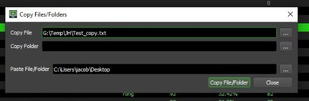
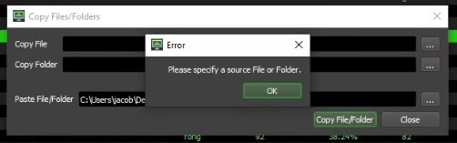
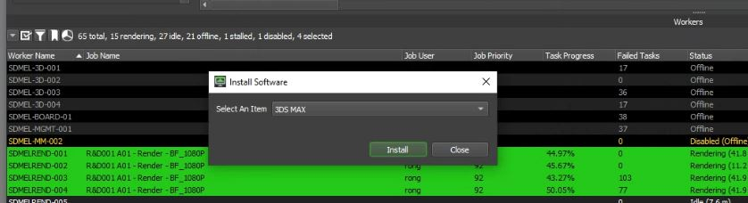
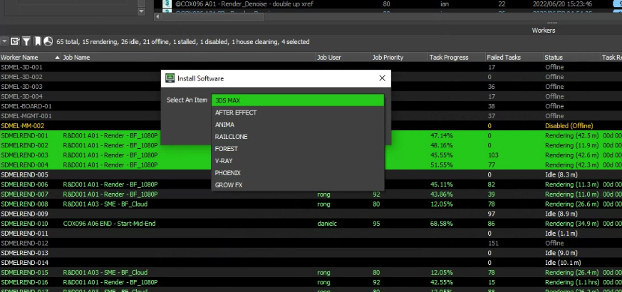

# Deadline Repo

## Custom Event callbacks

Scharp custom [deadline events](https://docs.thinkboxsoftware.com/products/deadline/10.1/1_User%20Manual/manual/event-plugins.html) are used to create call-backs actions on the render farm repository. These are used to improve the workflow for post-production by automating the extraction of layers, resizing animations/images and creating render logs for integration with photoshop scripting.

- [Create Render Log](CreateRenderLog/CreateRenderLog.py)
- [Extract Denoised EXR](ExtractDenisedEXR/ExtractDenisedEXR.py)
- [Resize Animations](ResizeAnimations/ResizeAnimations.py)
- [Resize Images](ResizeImagesWithTasks/ResizeImagesWithTasks.py)
- [Resize Images Non Denoised](ResizeImagesTileAssembly/ResizeImagesTileAssembly.py)

---

## UI Tools

This contains stand alone tools used to extend the capability of [deadline](https://aws.amazon.com/thinkbox-deadline/) by allowing the user to perform copy or software installation to multiple machines in the render farm symmaltainiously.

---
### Copy_Files_Or_Folders.py

This is the simple Copy Files/Folders UI.

Error checking is inplace to prevent improper use by the user.

---
### Update_Software.py
The Install Software UI is used to seed up the process of adding or updating software on the render farm of over 50 machines.

Common softare used for 3D rendering is selected from the drop down menu.

